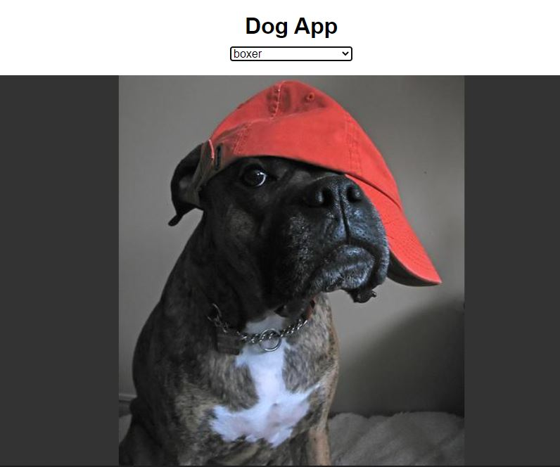

# AJAX-Puppy-App

I needed help learing AJAX so I followed this tutorial on YouTube. It was actually amazing.  The teacher; "LearnWebCode," did a fantastic job teaching this lesson and helped me understand AJAX calls better.  We also built a really fun project that uses the "Dog API," to get images and display them in the index.html file.  If you're interested in learning AJAX and would like to do this video yourself, you can find the tutorial <a href="https://www.youtube.com/watch?v=AVmGmLFcukM">here.</a>

